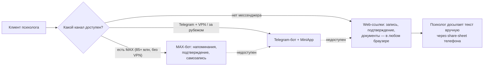
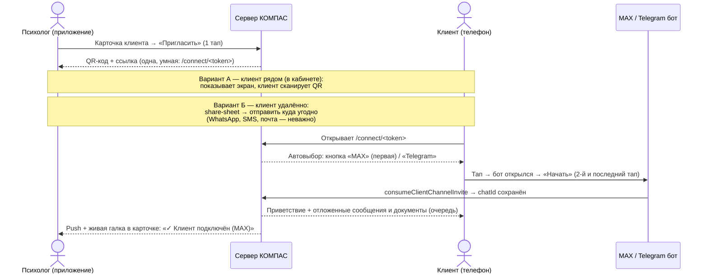
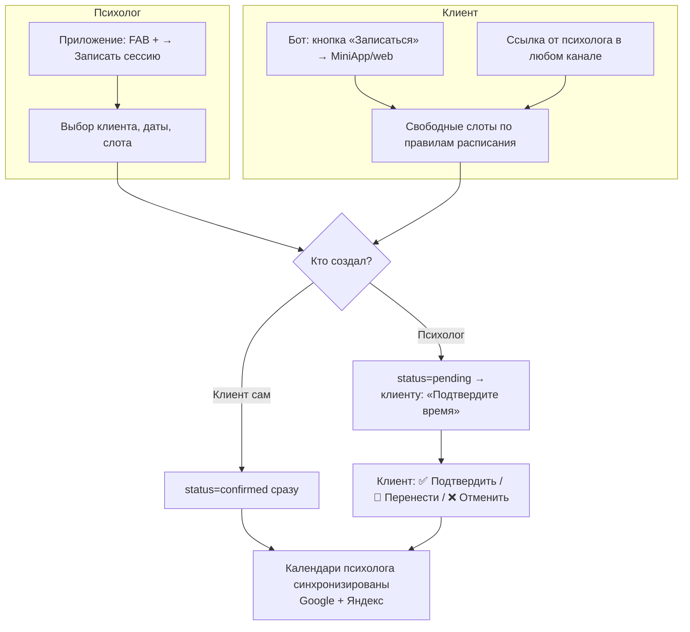
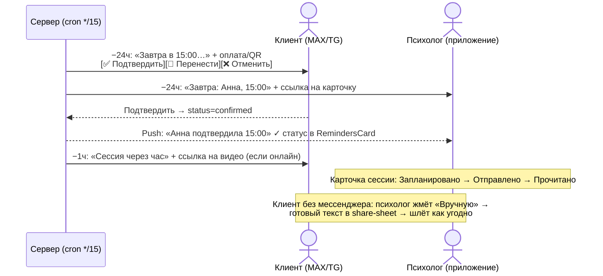
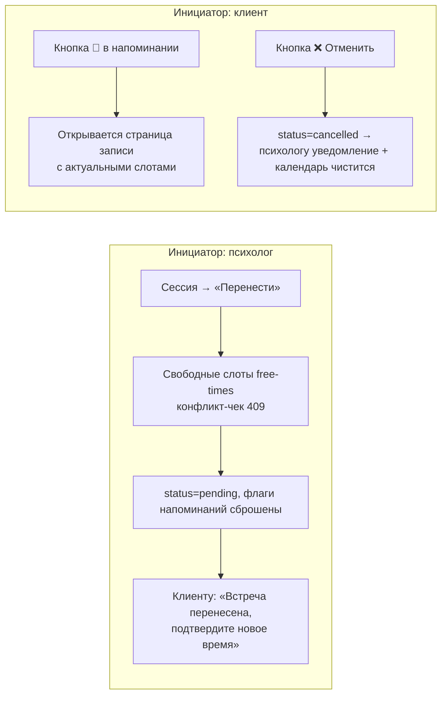
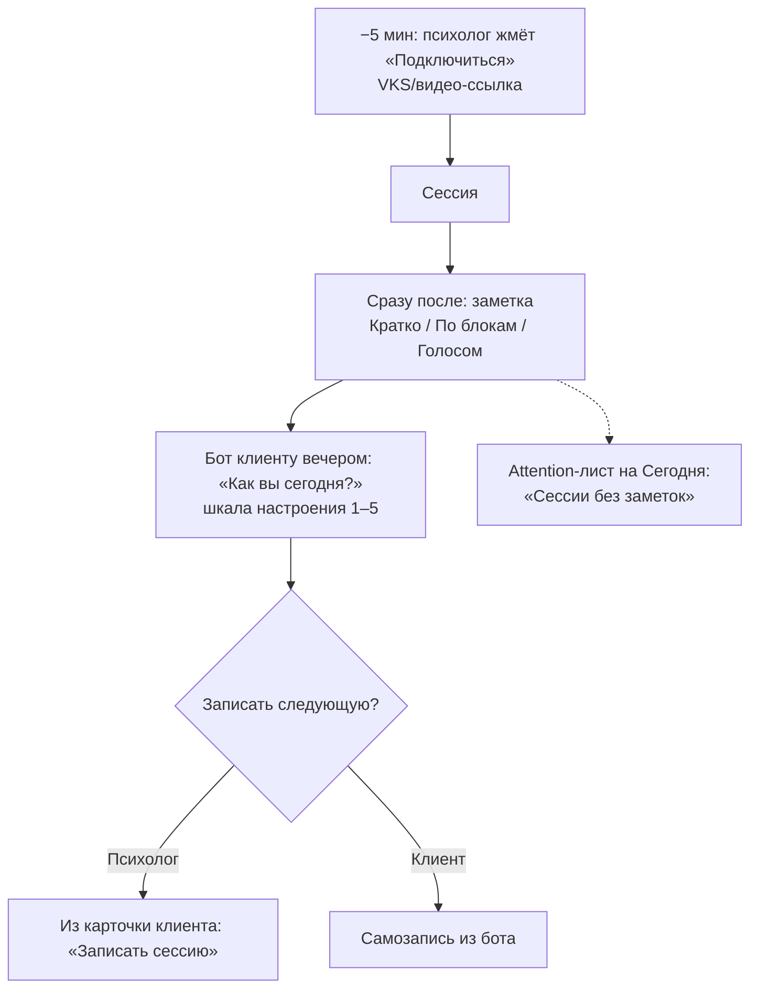
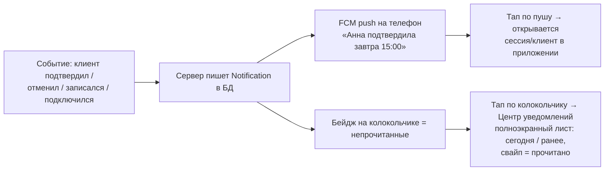
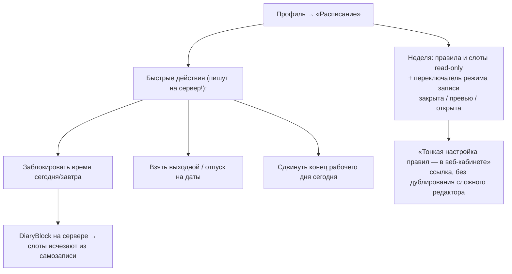

# CJM: психолог ↔ клиент — карта путей для бета-теста

> Психолог живёт в **приложении/вебе**. Клиент живёт в **мессенджере** (MAX — по умолчанию
> для РФ, Telegram — если доступен), в крайнем случае — **MiniApp / обычные web-ссылки**.
> Ядро — в вебе, мессенджер — слой доставки (см. `docs/strategy.md §3`).
>
> Легенда статусов реализации: ✅ работает · 🟡 частично / есть баг · ❌ нет.

---

## Каналы клиента: лестница деградации

Ключевой принцип: **канал выбирается по клиенту, а не по продукту**. Telegram в РФ
работает только через VPN, поэтому порядок предложения каналов — MAX → Telegram → без
мессенджера. Любой шаг пути обязан иметь web-fallback (обычная HTTPS-ссылка).

| Возможность клиента | MAX | Telegram | Web-fallback (без мессенджера) |
|---|---|---|---|
| Напоминание 24ч / 1ч | ✅ авто | ✅ авто (сервер шлёт через proxy) | 🟡 только вручную психологом |
| Подтвердить / отменить | ✅ кнопки | ✅ кнопки | ✅ HTTPS-ссылка `/api/client/session-action` |
| Самозапись | ✅ ссылка на web | ✅ MiniApp | ✅ `/bot/book/{id}?c=` в браузере |
| Мои записи | ✅ /sessions | ✅ MiniApp | ✅ `/bot/client` (localStorage) |
| Документы / согласия | ✅ ссылка | ✅ ссылка | ✅ `/client/documents/{id}?t=` |

---

## CJM-1 · Подключение клиента к каналу — «на раз-два» ⭐ сердце беты

**Сегодня:** 🟡 сервер готов (токены, smart-link `/connect/<t>`, deep-links, очередь
приветствий), но Android шарит **фейковую ссылку** → из приложения не работает вообще.
QR-кода нет. MAX выключен env-переменными.

**Целевой путь (психолог любой степени диджитализации):**

**Правила UX:**
- У психолога — **одна кнопка и одна ссылка**. Никаких «выберите канал» заранее:
  канал определяется тем, по какой кнопке кликнул клиент (`channel='auto'`).
- QR — обязателен: сценарий «клиент сидит напротив» — самый частый и самый простой.
- Приложение **само** показывает результат (поллинг статуса каналов), психологу не
  нужно спрашивать «получилось?».
- Если клиент так и не подключился за 72ч (TTL токена) — мягкое напоминание психологу
  в центре уведомлений: «Приглашение для Анны истекло — отправить новое?».

---

## CJM-2 · Запись на сессию — три входа

**Сегодня:** ✅ психолог из приложения · ✅ самозапись из бота/MiniApp · ✅ web-ссылка.

---

## CJM-3 · До сессии: напоминания и подтверждение

**Сегодня:** ✅ cron каждые 15 мин, волны 24ч и 1ч, кнопки-действия, HMAC-ссылки.
🟡 психолог в Android видит проекцию «за 2ч», а сервер шлёт «за 1ч» (рассинхрон текста).

---

## CJM-4 · Перенос и отмена — с обеих сторон

**Сегодня:** ✅ обе стороны работают; перенос сбрасывает в `pending` и переспрашивает клиента.

---

## CJM-5 · День сессии и после: заметка → чекин → следующая запись

**Сегодня:** ✅ видео-ссылка/VKS, заметки 3 режима · ✅ mood-чекин в боте (`mood_n`).

---

## CJM-6 · Уведомления психолога

**Сегодня:** 🟡 колокольчик → AlertDialog-попап, генерируются на лету, всегда «unread»,
пропадают через 7 дней. ❌ push нет (FCM заглушен со всех сторон).

**Целевой путь:**

Анти-паттерны (строго): никаких тревожных пушей, никакой рекламы в пушах, только
события практики. Тихие часы по умолчанию 21:00–9:00.

---

## CJM-7 · Расписание психолога с телефона

**Сегодня:** ✅ веб — полный редактор (правила, слоты, блокировки, режимы).
❌ Android — редактирования нет вовсе; «блокировка времени» сохраняется **только локально
на телефоне** и не видна ни серверу, ни самозаписи клиентов (тихая потеря данных).

**Целевой путь (мобильный минимум, не копия веба):**

---

## Сводка: что блокирует бету (из CJM → в ТЗ)

| # | Разрыв | CJM | Приоритет |
|---|---|---|---|
| 1 | Android шарит фейковую invite-ссылку; QR нет; статус привязки не обновляется live | CJM-1 | **P0** |
| 2 | MAX выключен (env), а для РФ это канал по умолчанию; Telegram-баг raw/hash токена | CJM-1 | **P0** |
| 3 | Блокировки времени из Android не доходят до сервера; расписание с телефона не править | CJM-7 | **P0** |
| 4 | Уведомления — попап без истории и read-state; push нет | CJM-6 | **P1** |
| 5 | Напоминания клиенту без мессенджера — только вручную (нет email-канала) | CJM-3 | P2 |
| 6 | Рассинхрон «за 2ч» (Android UI) vs «за 1ч» (сервер) | CJM-3 | P1 |

Детальное ТЗ по устранению: `docs/tz-codex-beta.md`.
